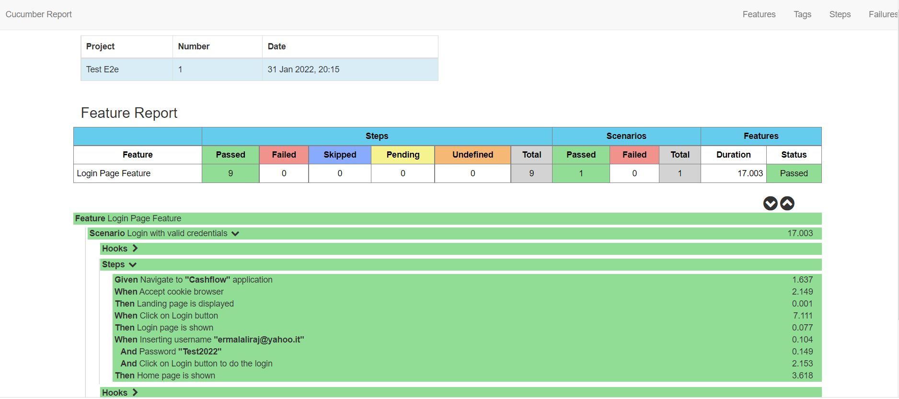

# Automation Test with Cucumber, TestNG and Selenium

### Configure local environment
Tests are configured to run with Chrome. Chrome driver is present in `/src/resources/driver/chromedriver.exe`

### Cucumber syntax - BDD Behaviour-Driven Development
In the `Login.feature` the steps are defined as follow:
```
Feature: Login Page Feature
  Scenario: Login with valid credentials
    Given Navigate to "Cashflow" application
    When Accept cookie browser
    Then Landing page is displayed
    When Click on Login button
    Then Login page is shown
    When Inserting username "ermalaliraj@yahoo.it"
    And Password "Test2022"
    And Click on Login button to do the login
    Then Home page is shown

```
    
### Run Tests
- `mvn clean install`

### Test results
On build complete, result will be present in: `../target/results/cucumber-maven-reports/cucumber-html-reports/overview-features.html`.
The output will look like this:  


### Links
[Video Tutorial - Page Object Mode](https://www.youtube.com/watch?v=LxJzeiTQGoE)
